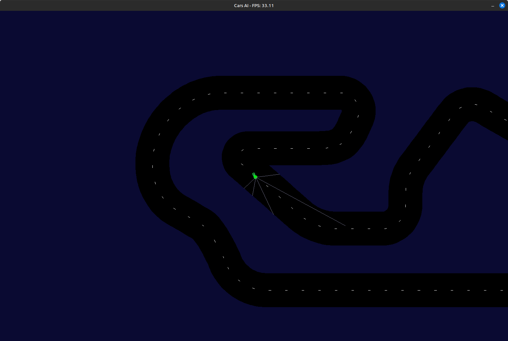

# Cars AI

## Introduction



POC to try to build a car AI with genetic algorithms to "evolve" neural network.

- Car LiDar sensors will be used to detect obstacles (road bounds).
- Neural network is custom numpy array with 6 Inputs (5 sensors, and 1 for current acceleration), and 4 Outputs (left, right, accelerate, brake).
- Car can be controlled manually with keyboard or AI.

### How to install

```
pip install -r Requirements.txt
```

### How to run

```
./App.py -n <population_count> -m <map_file>
```

If `population_count` is equal to 0 then car manual mode will be used (no AI).

You can specify which "brain" to use for the Car AI with `-b <brain_file>` argument.

### How to use

#### Controls
 - ESCAPE => Quit the program
 - R => Reset game
 - N => Next generation
 - M => Next map
 - B => Toggle drawing best only
 - LEFT => Turn car to left
 - RIGHT => Turn car to right
 - UP => Accelerate car
 - DOWN => Decelerate car
 - SPACE => Brake car
 - S => Toggle drawing sensors
 - A => Toggle drawing activation neural network
 - D => Toggle drawing map debug
 - H => Toggle hide/show map

### TODO

 - Improve Car Physics
 - Improve display information (population, generation, neural network, etc.)
 - Add more maps
 - Create championship with many maps to elect the best car of all maps